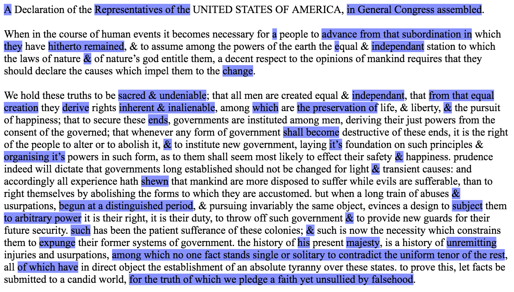
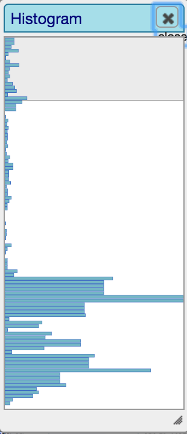
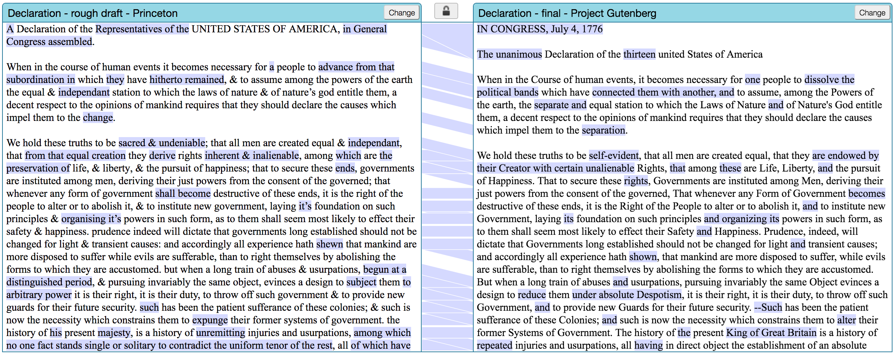

# Visualization

The fifth and final stage of GM, visualization, refers not only to graphic visualization, but to any serialization of the results of applying the first four stages. The separation of visualization into its own stage is important because it separates the issue or identifying moments of variation from the question of representing them, and defers decisions about rendering until the end of the collation process. Common visualization formats include the following:

## _Apparatus criticus_

Critical textual editions on paper have traditionally represented variation in a critical apparatus, as at the bottom of the example (copied from <http://lombardpress.org/assets/images/example-lbp-print-output.png>). The footnoted _apparatus criticus_ (critical apparatus) produces reference numbers for the lines being described, followed by the reading in the main (copy) text, then a “]” delimiter, and the variant readings, together with sigla indicating where they are attested. This is a negative appartus, which means that unless it says otherwise, it asserts that the manuscripts to do not differ significantly from the copy text. The notes above the _apparatus criticus_ are the _apparatus fontium et locorum parallelorum_, which identifies textual sources and parallels.

## Interlinear collation

An interlinear collation presents the full text of all of the witnesses, similarly to the way a conductor’s musical score provides, in parallel lines, the music played by all of the instruments in the orchestra. In this example, taken from <http://pvl.obdurodon.org/browser.xhtml>, the _paradosis_, the editors’ decision about the best reading (in this edition, a dynamic critical text that does not presume a “best witness”) is in red and annotated with the siglum “α”. A continuous reading text is rendered in the upper panel, while the lower panel shows a column-aligned table of variants token by token, retaining the original (diplomatic) orthography.

An interlinear collation obviously consumes more space than a critical apparatus (especially a negative critical apparatus) because it repeats text that is identical in different witnesses, although space is less of a concern with digital publication than with paper. One other limitation of an interlinear (essentially tabular) visualization is that there is no obvious natural way to represent transposition in a table.

In the diplomatic transcriptions used here, character-by-character identity is rare, but in a philological tradition where normalization of orthography is standard practice, the actual variation might be slight. Text from manuscript witnesses is in black; text from other published editions is in aqua. When the user clicks on a reference number in the reading view at the top, the variants from that section scroll into view in the lower panel.

The advantages of an interlinear collation over an _apparatus criticus_—which may or may not compensate for the additional consumption of space, are twofold:

1. An _apparatus criticus_ makes it difficult to read any of the control texts (the ones in the apparatus footnotes) continuously because the reader must piece together mentally words and phrases from different locations on the page. 
2. An _apparatus criticus_ is not practical with diplomatic transcription, at least in traditions that evidence substantial orthographic variation. Including all variation would make the _apparatus_ so large as to be even more unwieldy than it already is, while including only “significant” variants contradicts the principle of diplomatic transcription. 

The two methods, then, have complementary advantages and disadvantages.

The visualization resources built into CollateX include interlinear collations in plain text, plain HTML, and colored HTML (where parallel readings that agree in all witnesses are in one color and those that evidence variation are in another). The plain text may be rendered in a [Jupyter notebook](http://jupyter.org/) or written to disk; the HTML visualizations are intended to be rendered in the Jupyter notebook, and CollateX does not currently incorporate a method to export them as serialized HTML.

## XML

CollateX output may be exported as [TEI parallel segmentation](http://www.tei-c.org/release/doc/tei-p5-doc/en/html/TC.html#TCAPPS) or as a sort of generic XML, which is loosely based on TEI parallel segmentation. The the export may be incorporated into a TEI workflow; the generic XML output is intended for further processing with XSLT.

## The variant graph and SVG

CollateX represents the variation it identifies during the analysis stage as a _variant graph_, which may be serialized as [SVG](http://tutorials.jenkov.com/svg/index.html) (with simple and more complete options). In the SVG example here, taken from the CollateX documentation at <https://collatex.net/doc/>, the graph proceeds from left to right, with tokens represented by labeled nodes and their order represented by labeled, directed edges. In this example, witnesses 2 and 3 have a reading of “sacra” that contrasts with “assorta” in witness 3, they then all agree on the reading “e”, and then diverge, and then they all end. 

The variant graph may be difficult to read without practice, and it requires a lot of horizontal scrolling. On the other hand, it is the only visualization that is capable—at least in principle, since this functionality is not yet implemented—of representing transposition, which it could do with additional edges. The variant graph visualization is employed in [Stemmaweb](https://stemmaweb.net/), which is “a collection of tools for analysis of collated texts”.

The TRAViz development team (<http://www.traviz.vizcovery.org/>) produces railway visualizations of variant graphs, such as the one below. More recently they have proposed summary distant-reading graphic visualizations for long collations of large numbers of witnesses, such as the one below, taken from <http://dh2015.org/abstracts/xml/JANICKE_Stefan_A_Distant_Reading_Visualization_fo/J_NICKE_Stefan_A_Distant_Reading_Visualization_for_Vari.html> (see that site for an explanation of the color coding and the interactive interface).

## JSON

CollateX can serialize the result of alignment as a [JSON](http://www.json.org/) string, which can be exported as is for external processing or converted to a [Python dictionary](https://docs.python.org/3/tutorial/datastructures.html#dictionaries) for processing within a Python wrapper. Here is a sample collation table:

	+---+-----+-------+--------+-------+------+-----+------+-----+---+
	| A | The | brown | fox    | jumps | over | the | -    | dog | . |
	| B | The | brown | fox    | jumps | over | the | lazy | dog | . |
	| C | The | gray  | wombat | jumps | over | the | lazy | dog | . |
	+---+-----+-------+--------+-------+------+-----+------+-----+---+

 followed by its JSON serialization:

	{'table': [[[{'n': 'The', 't': 'The '}],
	   [{'n': 'brown', 't': 'brown '}],
	   [{'n': 'fox', 't': 'fox '}],
	   [{'n': 'jumps', 't': 'jumps '}],
	   [{'n': 'over', 't': 'over '}],
	   [{'n': 'the', 't': 'the '}],
	   None,
	   [{'n': 'dog', 't': 'dog'}],
	   [{'n': '.', 't': '.'}]],
	  [[{'n': 'The', 't': 'The '}],
	   [{'n': 'brown', 't': 'brown '}],
	   [{'n': 'fox', 't': 'fox '}],
	   [{'n': 'jumps', 't': 'jumps '}],
	   [{'n': 'over', 't': 'over '}],
	   [{'n': 'the', 't': 'the '}],
	   [{'n': 'lazy', 't': 'lazy '}],
	   [{'n': 'dog', 't': 'dog'}],
	   [{'n': '.', 't': '.'}]],
	  [[{'n': 'The', 't': 'The '}],
	   [{'n': 'gray', 't': 'gray '}],
	   [{'n': 'wombat', 't': 'wombat '}],
	   [{'n': 'jumps', 't': 'jumps '}],
	   [{'n': 'over', 't': 'over '}],
	   [{'n': 'the', 't': 'the '}],
	   [{'n': 'lazy', 't': 'lazy '}],
	   [{'n': 'dog', 't': 'dog'}],
	   [{'n': '.', 't': '.'}]]],
	 'witnesses': ['A', 'B', 'C']}

Even if you are not familiar with JSON or with Python dictionaries, you can see that each token is represent by a “t” (literal token) and “n” (normalized) value, and tht normalization removes trailing space characters from the tokens, as described in our overview of [normalization](week_2_day_1_normalization.md). 

## Other visualizations

Visualization needn’t be constrained by the common output formats supported by CollateX and other text-analysis toolkits. 

### Plectogram

[Daniel the Prisoner: A virtual florilegium](http://zatochnik.obdurodon.org) uses a [plectogram](https://www.academia.edu/1018153/_Modelling_the_genealogy_of_Maksim_Greks_collection_types_the_Plectogram_as_visual_aid_in_reconstruction._In_Medieval_Russian_Culture_v._2_ed._by_Michael_S._Flier_and_Daniel_Rowland._Berkeley._Los_Angeles_London_Univ._of_California_Press_1994_p._107-133._Preliminary_version_presented_at_Workshop_on_Medieval_East_Slavic_Culture_University_of_California_Los_Angeles_June_2-7_1990_) as both an illustration of textual parallelism (not variation) and a navigational aid, as in the example below:

### Juxta

[Juxta](http://www.juxtasoftware.org/) offers visualizations (of only two manuscripts at a time) as heat maps, histograms, and side-by-side views:

#### Heatmap

#### Histogram

The histogram provides a navigational interface for the heatmap.

#### Side by side

